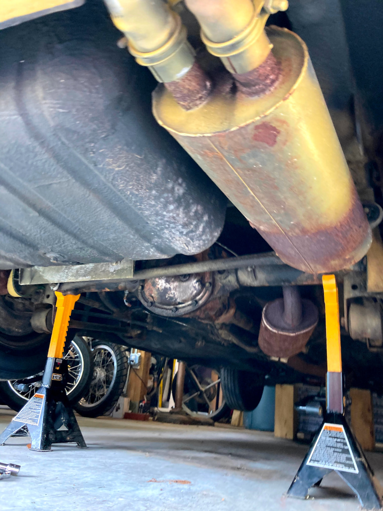
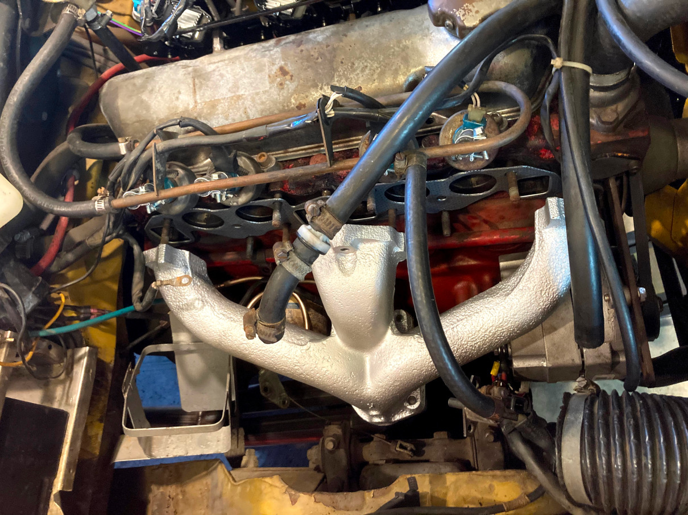
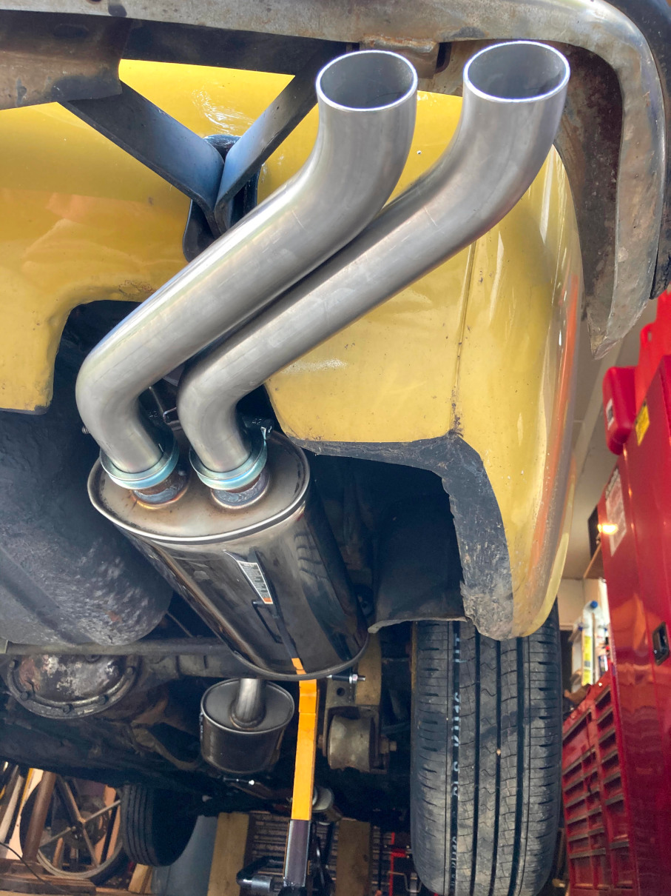
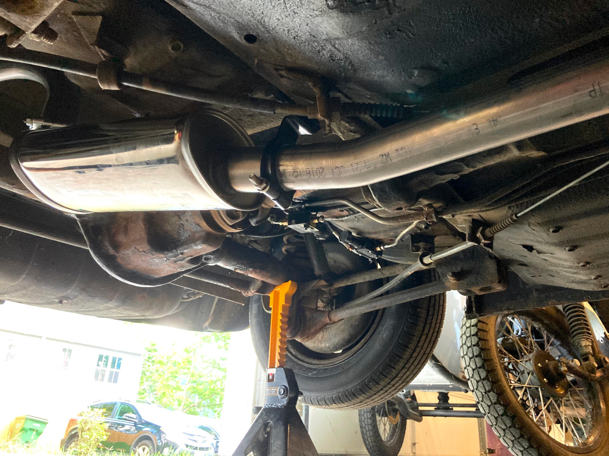
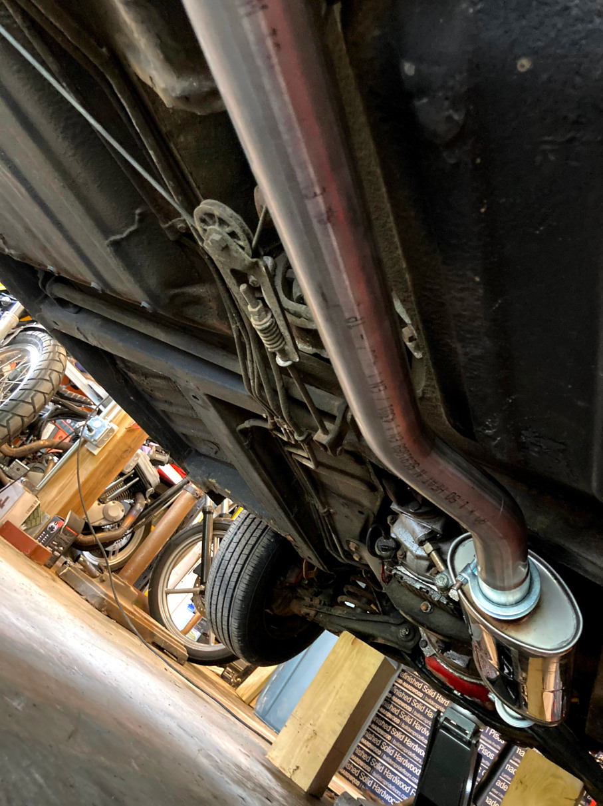
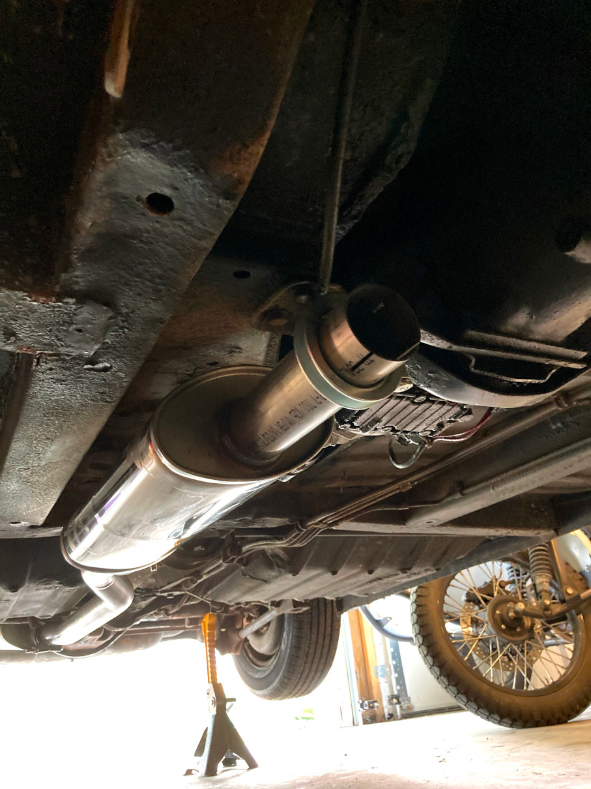

I decided early on I would want to replace the fuel injection system with a modern standalone system. I chose to go with [Speeduino](https://speeduino.com/home/). I knew from the beginning this would require adding an oxygen sensor, as the factory Bosch system did not use one, and the easiest way to accomplish this would be to purchase a new stainless exhaust system (a worthwhile upgrade on it's own), and weld in a bung before installation. The exhaust was purchased from [VP Autoparts](https://vp-autoparts.com) along with a new mounting kit. I purchased a generic stainless O2 sensor bung and plug and welded them in just past the final collector. I also had the rusty cast iron exhaust manifold ceramic coated at the same time. Two of the three exhaust manifold studs had to be drilled out and thread repaired because after 50 years they had rusted together. The pictures show the before and after. It was a bit of a wrestling match to get the whole system installed, but now 4 years later what I remember is I think the best way to do it is installing the downpipe on the manifold off the car, then installing the manifold to the head, and then installing each piece one at a time working front to back. Getting to all of the manifold nuts was a pain, but doable with sufficient socket extensions and wobble joints.

The stock system, presumably original. Very rusty and with some overspray from when the car was repainted.

The stock cast iron manifold, ceramic coated to contain heat and prevent rust.

The new system installed, polished stainless, with stock-style S-bend muffler tips. You can see all 3 mufflers, same as the stock system.

A view of the second muffler in place, looking to the rear.

A view of the first muffler just behind and to the right of the transmission, looking forward.

A view of the first muffler from the front looking to the rear, with the finned sump cover of the Laycock overdrive just visible to the right. I would recommend against installing this before the downpipe, as is shown. Start at the front and work your way back.
