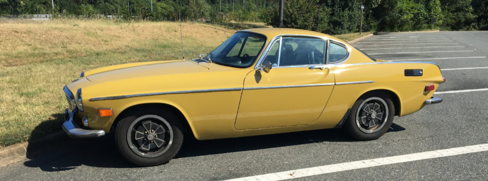

## 1970 Volvo 1800E Rehab Project Documentation

These pages document the work I've done and am planning for my car, mostly as a way for me to remember what I've done. They are primarily for my own use, which should explain the style and format chosen. 

When I purchased the car on August 12, 2019, it was running and driving and reasonably maintained as a Sunday driver. The seller was surprised when I told him I as going to drive it straight home from Washington, D.C. to Richmond, Virginia during rush hour, but I made the trip without any major problems. The charging system warning light came on, and the gauge lights didn't work, but overall the trip didn't have any major failures. While it was in overall good shape compared to many 1800s that come up for sale, it was in need of lots of maintenance across all the systems of the car.

1. [Initial Repairs](Initial%20Repairs.md)
2. [Exhaust](Exhaust.md)
3. [Fuel Injection System](Fuel%20Injection.md) - Speeduino
4. [Transmission & Driveshaft](Transmission.md)
5. [Front Suspension](Front%20Suspension.md)
6. [Rear Suspension & Axle w/ LSD](Rear%20Suspension.md)
7. HVAC install
8. Rust repairs - sills/rockers