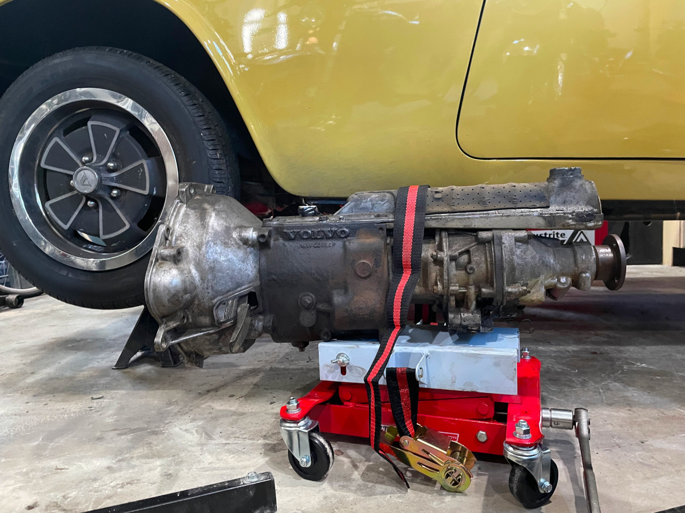
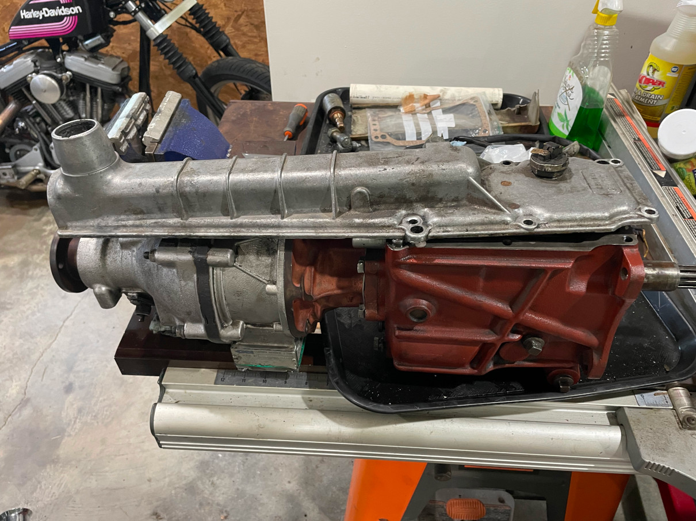
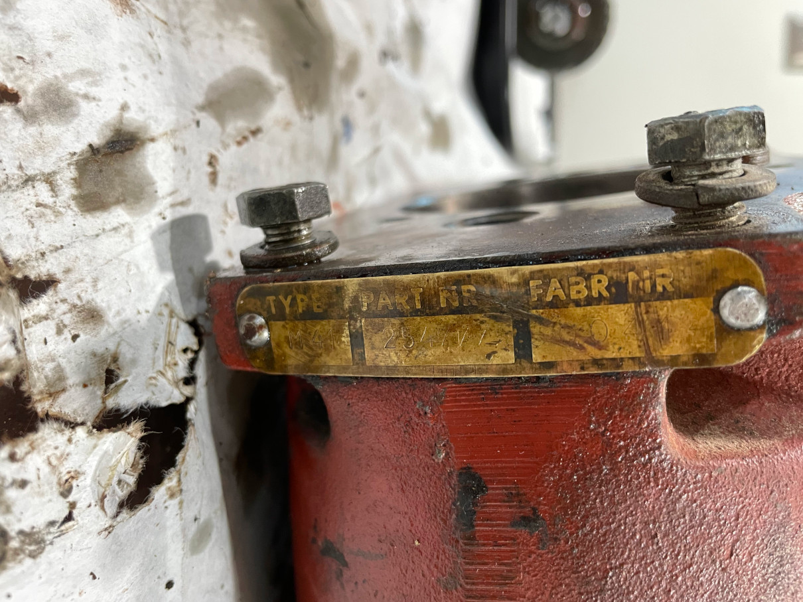
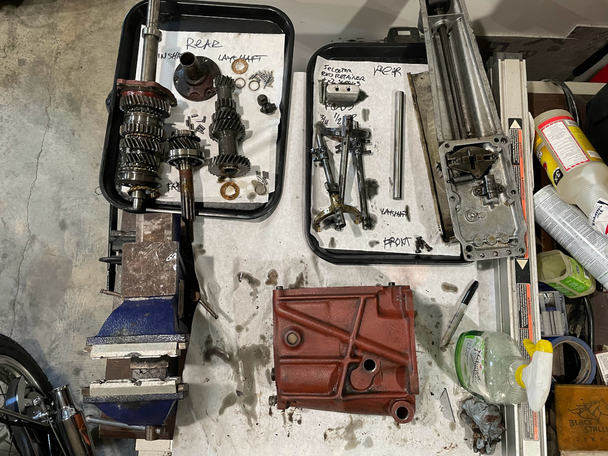
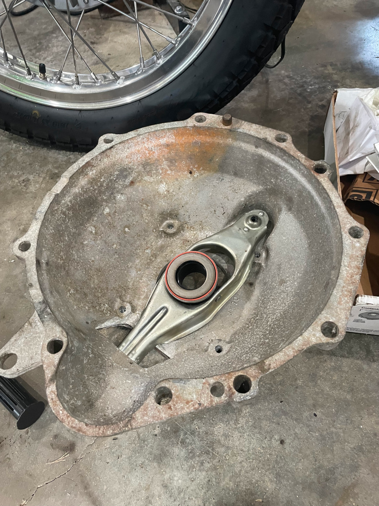
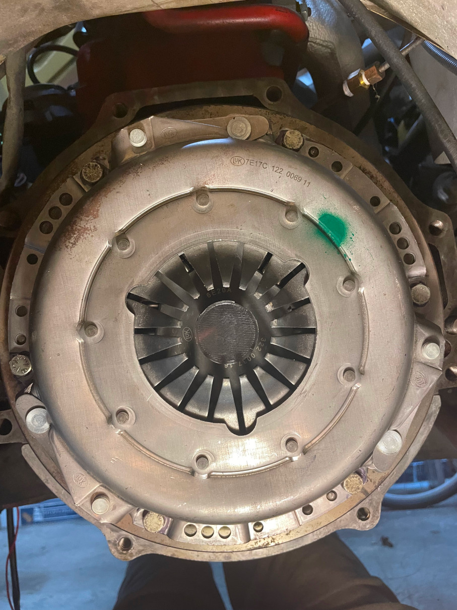
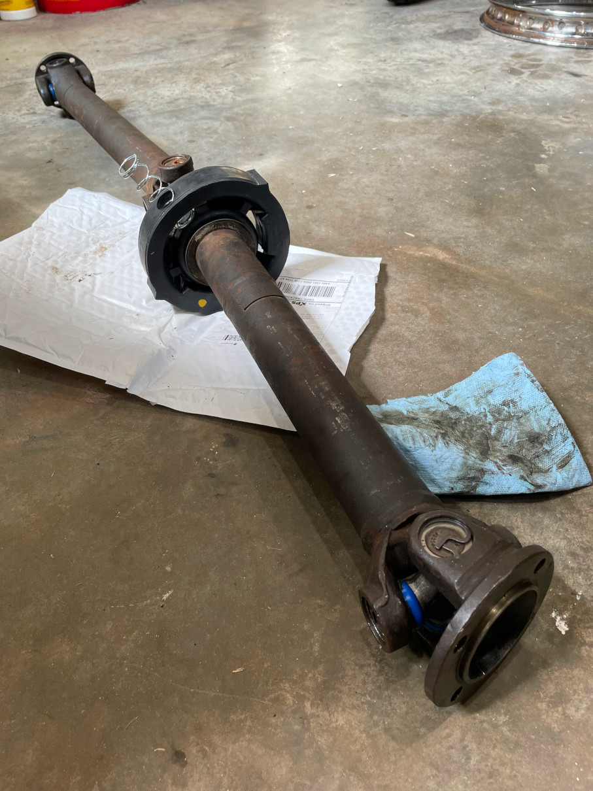

I decided repairing the transmission would be one of the first major mechanical repairs I would make because it was leaking badly and left a huge puddle on my garage floor, it didn't shift smoothly, often it would feel like it had shifted into second gear but not actually engage, and going into reverse it would often grind a bit. I found a spare M41 transmission for sale locally that was only $250 that I could rebuild on the bench and then just swap with my stock M410 unit, instead of having the car on jackstands for weeks. In retrospect this was kind of a waste, as I then decided that I would dive in and make this the year I did all the major work on the car, so it was only off the stands for 2 weeks.

The rebuild went fairly smoothly after reading the guide available on [VClassics](http://www.vclassics.com/archive/tranreb.htm) and watching the rebuild video from [Amazon Cars](https://amazoncars.co.uk/). Amazon Cars videos are now only available to their Patreon subscribers, I found it well worth the money. The only significant snags were that the donor transmission was probably from a very late 1973 1800ES, which had a larger diameter layshaft and a different top cover and shifter assembly. The layshaft issue just meant that I had to order the layshaft thrust washers twice since the first order I got the wrong size. I did get the correct size layshaft, thankfully. The top cover issue is complicated because I didn't get a shifter assembly with the donor trans and the shifter I had from the M410 didn't fit. The later shifter is very rare, they might have been used in other cars but I think it was probably only used in less than 1000 1800s. Another issue was that the M41 I have included the reverse light switch on the top cover, when it was built into the rear of the trans case on the M410, so although the covers are interchangeable, the one I had from the M410 was missing the reverse switch fittings. In the end the easiest fix was to purchase a top cover from a 1972 car which used the same shifter and had a built in reverse light mechanism. I purchased it from Don Thibault at [P1800.com](https://p1800.com). The communication left something to be desired, but the part came and worked fine in the end. The reverse switch has to be set to the correct depth upon installation in order to work properly, so I used a multimeter to get the depth just right, and then found a suitable O-ring to fit the gap left between the switch and the cover. I also used blue Loctite to keep in from backing out. I also replaced the original felt rear main engine seal with a silicone seal while I had the transmission out, and the pilot bearing as well. The engine runs great and I don't plan on pulling it until/if I want to get more power out of it. The car came with a new clutch kit and release arm when I bought it, so I installed that as well. I coated all of the paper gaskets with Hylomar Blue to prevent leaks, and greased all the moving parts inside during assembly. For initial break in I put in straight SAE30W motor oil, and will change to Redline MT-90 after about 500 miles.

The gears and everything in the donor trans looked great, it probably didn't need a rebuild but since I did the work myself it was worth spending $500 up front to have the piece of mind. The parts replaced ended up being:

* All seals, gaskets, and O-rings for the M41
* All the external gaskets and seals on the J-type overdrive (I did not do a full rebuild of the overdrive, if they get regular oil changes they rarely need any internal repairs)
* All the synchros
* Shift dog springs
* Shift dogs (I actually reused the small ones, since they didn't have any visible wear and the new ones had some type of black finish that scratched off and made them feel kinda rough when shifting through the gears on the bench)
* Both mainshaft roller bearings
* Layshaft (the old shaft looked OK, but there was scuffing where the bearings ride and I couldn't tell if the hardening was worn or not. Worth $70 not to worry about it.)
* Layshaft thrust washers
* Shift fork faces
* Trans mount rubber (Used a heavy duty mount from a 164)
* New trans mount bracket since the M41 didn't come with one
* Stainless bellhousing mounting bolts 
* Shifter bushings (lower and upper)
* Shifter ball seat (plastic washer)
* Shift knob (The original was faded and worn)
* Engine rear main seal
* Luk clutch and pressure plate, plus new clutch release arm and throwout bearing w/ plastic cage
* All 3 driveshaft u-joints (Spicer 5-153X)
* Driveshaft center bearing (I got a Nachi 6009-2NSE), carrier, and support spring
* Driveshaft seal/bellows

At this time I can't do a proper test drive while I'm troubleshooting the fuel injection, but just going around the block the clutch was much lighter and the shifting tight. 

The original M410 transmission removed from the car. The M410 is supposed to be much more robust (I've seen it reported to be good for 400 ft-lbs!) than the M41. Perhaps they thought the M41 wasn't strong enough for the 135hp of the EFI engine, but it's got 2 more big expensive roller bearings so that's probably why they went back to the M41, making the M410 a one year only item for the 1800s.  It's easily identified by the smooth case vs. the angled ribs on the M41. I will keep this for the possibilty of future horsepower.

The donor late 1973 M41 transmission that uses a rare circlip-retained shifter. Not compatible with the shifter that's retained using a huge nut.

The ID tag from the M41. It reads "TYPE M41 PART NR 254777 FABR NR 300444". I took this because multiple 1800 "expert" old farts told me this combination was never made.

The disassmbled, labeled parts from the donor. This was before stripping the mainshaft.

The parts that were replaced from the M41. If you look closely you'll see that the 3 short shift dogs are actually new and black, compared to the long shift dogs. The short ones didn't get replaced because I thought the old ones were smoother and didn't have much wear. The used layshaft was cut down and used as a dummy spacer to hold the bearings in while the layshaft was installed.

The M41 bellhousing with a new clutch release fork and plastic throwout bearing. The previous owner bought the fork along with a Luk clutch kit from p1800.com 2 years before I bought the car, but never had it installed because whatever problem he thought it would fix was a transmission problem. Saved me about $300. The M41 bellhousing is attached to the trans with external bolts, so it can be installed separately from the trans if you wish. The M410 has the bolts inside the bellhousing and you have to pull the bellhousing and trans together.

The original rear main seal. There is a felt seal with a steel ring over it, held in by a circlip. In the center is the pilot bearing, also retained with a steel ring and circlip. I removed the old pilot bearing by stuffing the hole with wet toilet paper and hammering it in with a drift, and repeating until the bearing eventually popped out. It was messy but worked a treat, I didn't have to buy a special tool. 

The new rear main seal. These are readily available and should seal much better, especially with intermittent use as this car will see. You need to gently part the seal holder from the oil pan gasket with a razor blade if you don't want to replace the oil pan gasket, which can't be done with the engine and front crossmember in the car. I ended up pulling the crossmember a few weeks later so I'll take the opportunity to replace the gasket since I don't have plans to pull the engine.

The new clutch and pressure plate installed, with clutch centering tool shown. My clutch kit came with the wrong size centering tool, but amazingly I found a 3d-printable model on [Thingiverse](https://www.thingiverse.com/thing:4842622) and had it printed at the local library for under $5. 

The old clutch removed. Still seems to have a decent amount of friction material, but I'll replace it with new since I have the parts.

The M41 being installed. The clutch, pressure plate, and bellhousing have already been installed and torqued. This made it a little easier to maneuver the trans while lying on a creeper under the car. I can't imagine doing it without the trans lift. I tried to get the wiring installed while the trans was still lowered, but I ended up having to remove it and install it blind once the trans was in place because the wires were too short.

The M41 installed and mounted. It's still missing an exhaust hanger that I need to order. This is before the driveshaft was reinstalled.

The driveshaft ready to be reinstalled. I replaced the 3 u-joints, the center bearing and carrier, and the slip joint seal/bellows. The 1800s came with 2 different sized drive shafts. This is the later, larger diameter unit. It takes a 6009 size bearing and 3x 1310 series u-joints. RockAuto has the u-joints wrong, but maybe they will update their listing now that I've informed them. Nothing special about this install except that it's a bit of a bear getting the bearing squeezed into the rubber carrier. It needs to be lubed with something like dish soap and water.